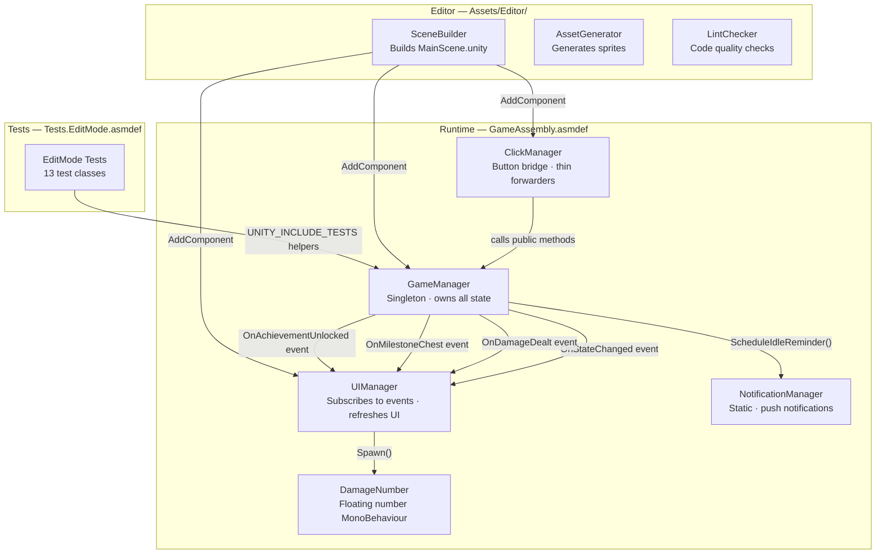
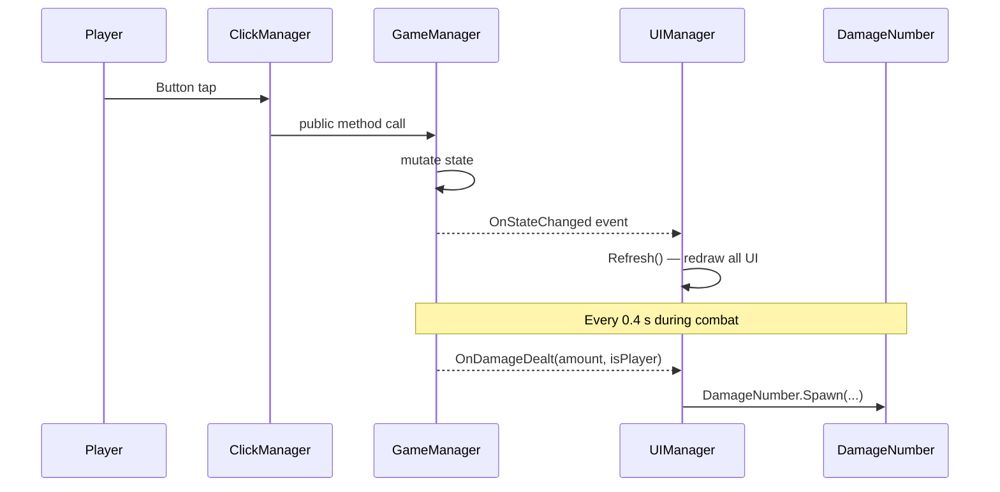
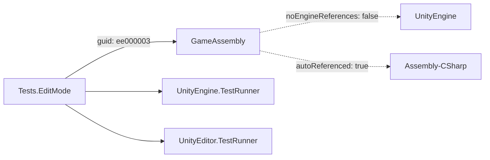

# Architecture

## Component Diagram

## Script Responsibilities

| Script | Assembly | Responsibility |
|--------|----------|----------------|
| `GameManager` | GameAssembly | Singleton. Owns every piece of game state. Runs `Update()` which drives the combat loop, resource accumulation, timers, and save/load. Fires `OnStateChanged` whenever state changes so UI can refresh. |
| `UIManager` | GameAssembly | Subscribes to `GameManager` events in `Start()`. Calls `Refresh()` on every `OnStateChanged` to redraw all UI elements. Holds `[SerializeField]` references to every `Text`, `Button`, `Image`, and panel `GameObject`. |
| `ClickManager` | GameAssembly | One-liner bridge between Unity button `onClick` events and `GameManager` public methods. Zero logic — pure forwarding. |
| `DamageNumber` | GameAssembly | Pooled-style floating text that rises and fades over ~1.1 s. Spawned by `UIManager.SpawnDamageNumber()` in response to `OnDamageDealt`. |
| `NotificationManager` | GameAssembly | Static class. Schedules/cancels Android and iOS push notifications. Called by `GameManager.ToggleNotifications()`. |
| `SceneBuilder` | Editor | `[MenuItem("IdleClicker/Setup Scene")]`. Builds the entire scene from scratch, wires all serialized references, and adds all button listeners using `UnityEventTools`. |
| `AssetGenerator` | Editor | `[MenuItem("IdleClicker/Generate Assets")]`. Creates `rounded_rect.png` and all enemy sprites programmatically. |
| `LintChecker` | Editor | `[MenuItem("IdleClicker/Run Lint Check")]`. Scans `Assets/Scripts/` for `Debug.Log`, hardcoded PATs, TODO markers, and naked catch blocks. |

## Event Connections

## Assembly Graph

## Save / Load

All persistent state is stored in `PlayerPrefs` (key-value strings/ints/floats). `Save()` is called automatically every 30 seconds from `Update()` and on key events. `Load()` runs once in `Awake()`. See [scripts/GameManager.md](scripts/GameManager.md) for the full key list.
