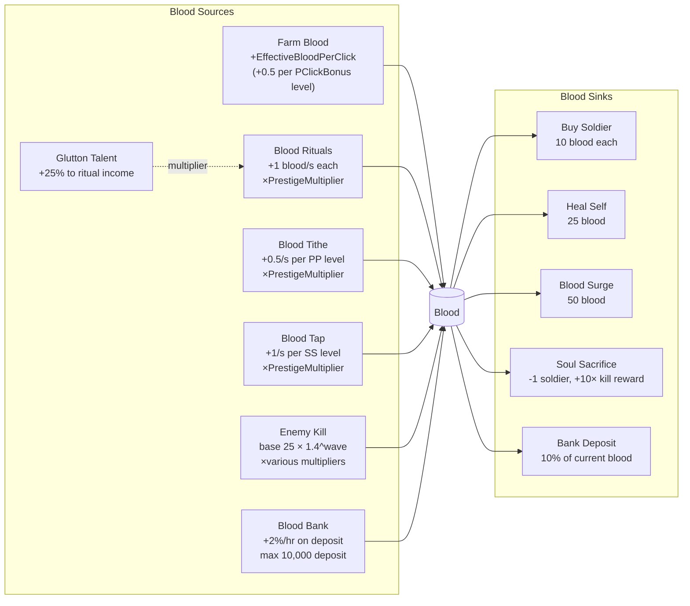
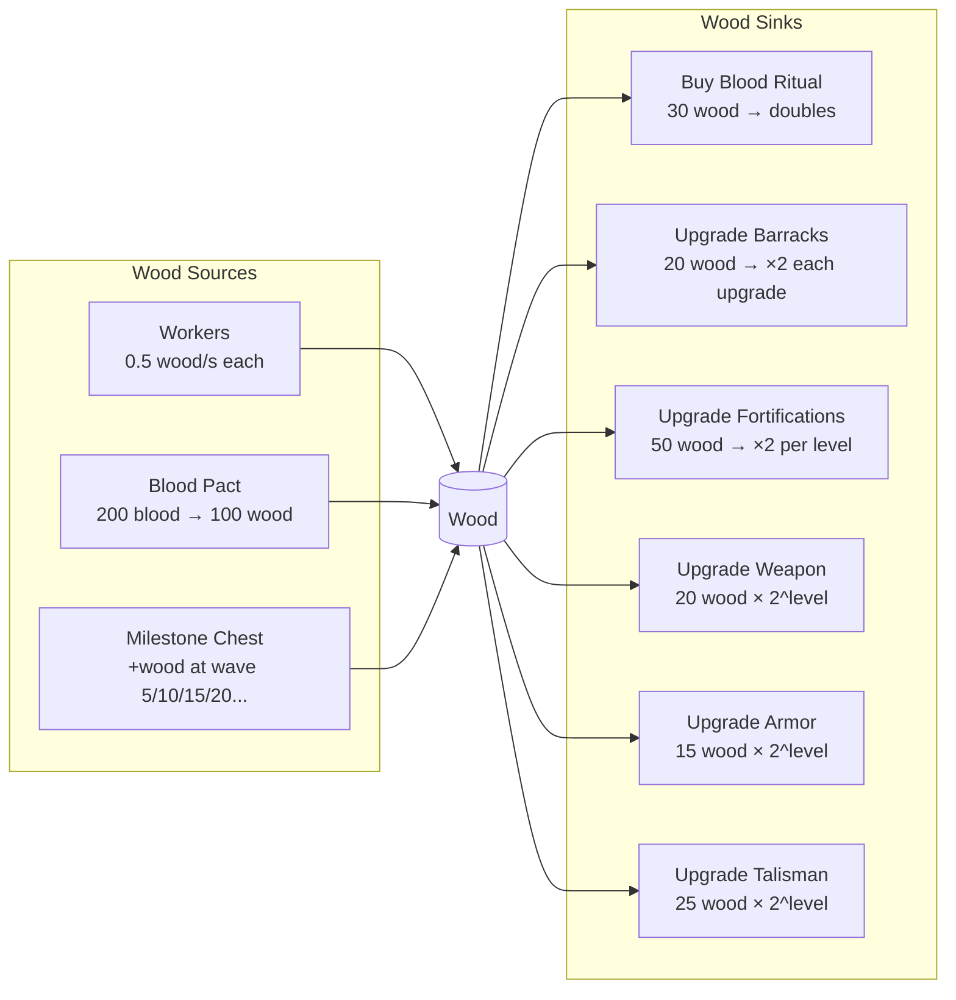
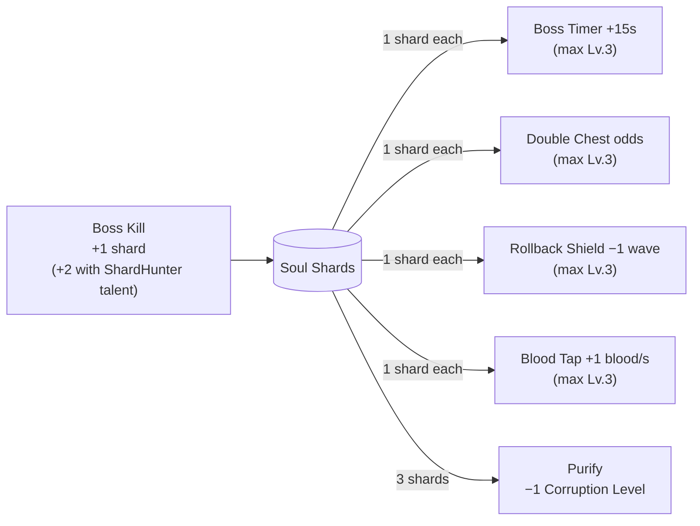

# Economy

## Resources

| Resource | Storage | Primary Source | Sink |
|----------|---------|----------------|------|
| Blood | `double Blood` | Clicks, rituals, kills | Soldiers, spells, bank deposits |
| Wood | `double Wood` | Workers (0.5/s each) | Barracks, rituals, equipment, fortifications |
| Soul Shards | `double SoulShards` | Boss kills | Soul Shard Shop upgrades, Purify |
| Prestige Points | `int PrestigePoints` | One per prestige | Prestige Shop purchases |

## Blood Flow



## Wood Flow



## Soul Shard Flow



## Unlock Thresholds

Unlocks trigger inside `AddBlood()` by checking `TotalBloodEarned`:

| Threshold | Unlock |
|-----------|--------|
| 10 blood | Buy first soldier (UI implicit — cost check) |
| 50 blood | Buy worker (cost check) |
| 200 blood earned | Workers panel visible |
| 250 blood earned | Heal Self spell |
| 500 blood earned | Blood Surge spell |

## Prestige Multiplier

```
PrestigeMultiplier = 1.0 + 0.5 × PrestigeCount
```

Affects: kill rewards, blood ritual income, blood tithe, blood tap, effective blood per click. Does NOT affect wood income or wood costs.

## Blood Bank

- Deposit: 10% of current blood per press, capped at 10,000 total deposit.
- Interest: 2%/hr of deposit, continuously accrued (not compounded).
- Withdraw: returns deposit + all accrued interest instantly.
- Deposit survives prestige; soldiers and blood do not.

## Milestone Chests

Every 5th wave (wave 5, 10, 15, 20 …) a chest fires `OnMilestoneChest` and grants one of:
- Blood bonus: `floor(100 × wave × PrestigeMultiplier × mult)`
- Free soldier (Tank or Berserker, random) — or blood if at cap
- Wood bonus: `floor(25 × wave × mult)` where mult = 2× if `SSDoubleChestLevel > 0`
