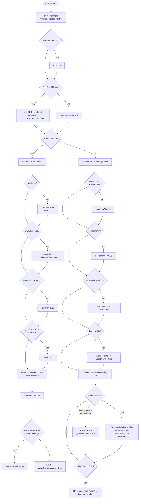
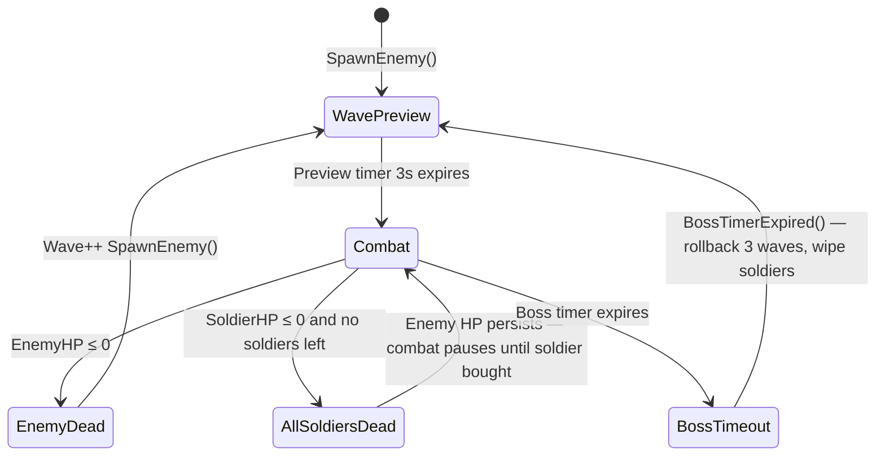

# Game Flow

## Main Update Loop

Every frame, `GameManager.Update()` runs a set of independent subsystems. Each subsystem sets `changed = true` if it mutated state, and `OnStateChanged` fires at the end if anything changed.

```mermaid
flowchart TD
    U([Update dt]) --> SURGE{SurgeActive?}
    SURGE -->|yes| DT1[Decrement SurgeTimeRemaining]
    SURGE --> REGEN{All-Tank army\n& HP < max?}
    DT1 --> REGEN
    REGEN -->|yes| DT2[Regen HP at TankRegenRate]
    REGEN --> PAL{PaladinCount > 0\n& HP < max?}
    DT2 --> PAL
    PAL -->|yes| DT3[Heal at PaladinHealRate × count]
    PAL --> TAP{SSBloodTapLevel > 0?}
    DT3 --> TAP
    TAP -->|yes| DT4[AddBlood BloodTapPerSec × dt]
    TAP --> FLAWLESS{EnemyHP > 0\n& !WavePreview?}
    DT4 --> FLAWLESS
    FLAWLESS -->|yes| DT5[Increment flawless timer]
    FLAWLESS --> WORKERS{WorkerCount > 0?}
    DT5 --> WORKERS
    WORKERS -->|yes| DT6[Wood += WoodPerSecond × dt]
    WORKERS --> RITUALS{BloodPerSec > 0?}
    DT6 --> RITUALS
    RITUALS -->|yes| DT7[AddBlood BloodPerSec × dt]
    RITUALS --> BANK{BloodBankDeposit > 0?}
    DT7 --> BANK
    BANK -->|yes| DT8[Accrue bank interest]
    BANK --> REGEN2{Enemy Regen modifier?}
    DT8 --> REGEN2
    REGEN2 -->|yes| DT9[EnemyHP += EnemyMaxHP × 2% × dt]
    REGEN2 --> PREVIEW{WavePreviewActive?}
    DT9 --> PREVIEW
    PREVIEW -->|timer expired| SP[SpawnEnemy wave]
    PREVIEW --> COMBAT{Soldiers > 0\n& EnemyHP > 0?}
    SP --> COMBAT
    COMBAT -->|yes| RC[RunCombat dt]
    COMBAT --> CHALLENGE{DailyChallengeActive\n& timer > 0?}
    RC --> CHALLENGE
    CHALLENGE -->|timer out| CE[End challenge]
    CHALLENGE --> BOSS{IsBossWave\n& !Challenge?}
    CE --> BOSS
    BOSS -->|timer out| BTE[BossTimerExpired]
    BOSS --> FIRE{changed?}
    BTE --> FIRE
    FIRE -->|yes| EVT[OnStateChanged.Invoke]
```



## Combat Round



## Player Actions

```mermaid
flowchart LR
    subgraph Blood["Blood Actions"]
        FB[Farm Blood\n+EffectiveBloodPerClick]
        HealSelf[Heal Self\n-25 blood +20 HP]
        Surge[Blood Surge\n-50 blood 2× atk 10s]
        Pact[Blood Pact\n-200 blood +100 wood]
        SoulSac[Soul Sacrifice\n-1 soldier ×10 blood reward]
        Deposit[Deposit to Bank\n10% of blood]
    end

    subgraph Wood["Wood Actions"]
        Worker[Buy Worker\n-50 blood +0.5 wood/s]
        Ritual[Buy Blood Ritual\n-30 wood +1 blood/s]
        Barracks[Upgrade Barracks\n-20 wood +5 soldier cap]
        Fort[Upgrade Fort\n-50 wood −2% enemy HP]
        Equip[Upgrade Equipment\nWeapon/Armor/Talisman]
    end

    subgraph Prestige["Prestige Actions"]
        Prestige[Request Prestige\nwave ≥ 20]
        Talent[Choose Talent\n3 random options]
        PresShop[Prestige Shop\n1 PP per upgrade]
        Purify[Purify\n-3 soul shards −1 corruption]
    end

    subgraph SoulShard["Soul Shard Shop\nunlocked on first boss kill"]
        SSBoss[Boss Timer +15s]
        SSDouble[Double Chest chance]
        SSRollback[Rollback Shield −1 wave]
        SSBloodTap[Blood Tap +1 blood/s]
    end
```

## Wave Progression


