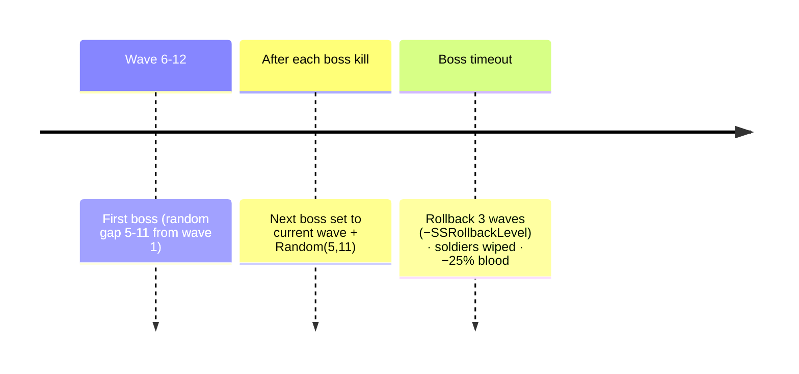
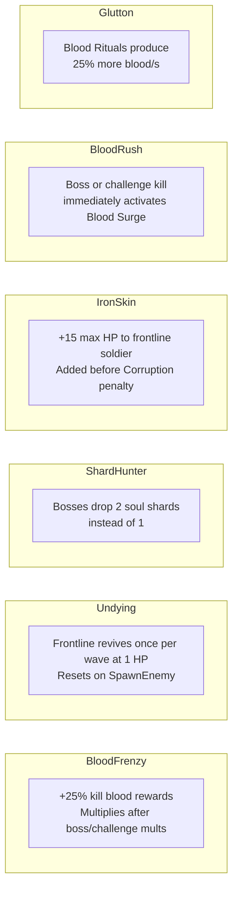

# Progression

## Wave Scaling

Each wave the enemy scales up:

| Stat | Scale Factor | Formula |
|------|-------------|---------|
| Enemy HP | ×1.5 per wave | `100 × 1.5^(wave-1) × typeMult × (1 - fortReduction)` |
| Enemy Attack | ×1.3 per wave | `3 × 1.3^(wave-1) × typeMult` |
| Kill Reward | ×1.4 per wave | `floor(25 × 1.4^(wave-1) × PrestigeMultiplier × talismanMult)` |

Boss HP is 5× the normal formula. Boss attack is 2× normal.

## Enemy Pool

12 normal enemy types plus 8 boss names drawn randomly:

| Enemy | HP Mult | Atk Mult |
|-------|---------|---------|
| Goblin | 0.6 | 0.7 |
| Skeleton | 0.7 | 0.9 |
| Orc Warrior | 1.0 | 1.0 |
| Cave Troll | 1.5 | 0.8 |
| Werewolf | 1.1 | 1.3 |
| Stone Ogre | 2.0 | 0.6 |
| Ice Giant | 1.8 | 0.9 |
| Demon Knight | 1.2 | 1.4 |
| Dark Witch | 0.8 | 1.7 |
| Vampire Lord | 1.0 | 1.6 |
| Lich | 0.9 | 1.5 |
| Ancient Dragon | 2.5 | 2.0 |

## Boss Waves



## Prestige

**Requirement**: Wave ≥ 20.

**Flow**:
1. Player presses Prestige → `RequestPrestige()` generates 3 random talent options.
2. Talent selection modal shows.
3. Player picks a talent → `ConfirmPrestige(idx)` applies it then calls `Prestige()`.
4. `Prestige()` increments `PrestigeCount` and `PrestigePoints`, increments `CorruptionLevel` (max 5), resets combat state.

**Resets on prestige**:
- Blood, Wood, soldiers, workers, blood rituals, equipment levels, fortification, barracks level (but not max soldiers from PSoldierCap), wave back to 1.

**Survives prestige**:
- PrestigeCount, PrestigeMultiplier, PrestigePoints, Prestige Shop upgrades, TotalBloodEarned, SoulShards, Soul Shard Shop levels, Talents, Blood Bank deposit.

## Prestige Shop

Costs 1 Prestige Point per purchase. No cap on levels (stack indefinitely).

| Upgrade | Effect |
|---------|--------|
| Soldier Cap | +10 MaxSoldiers per level |
| Click Bonus | +0.5 blood per click per level |
| Ritual Efficiency | +0.5 blood/s per ritual per level |
| Weapon Head Start | Unlocks weapon level 1 after prestige |
| Blood Tithe | +0.5 blood/s passive per level (×PrestigeMultiplier) |
| Iron Wall | −10% incoming enemy damage per level (max 3 meaningful levels before 100% reduction) |

## Talent Tree

Unlocked on first prestige. Each prestige offers 3 random talents not yet owned. Owns up to 6 total (one of each).



## Blood Corruption

Each prestige adds 1 Corruption Level (max 5). Effect:

```
FrontlineMaxHP -= CorruptionLevel × 5
(minimum effective HP: 10)
```

**Purify**: spend 3 soul shards to remove 1 corruption level. Requires Soul Shard Shop to be unlocked.

## Prestige Milestones

Passive attack bonus every time PrestigeCount reaches a milestone:

| Milestone | Bonus |
|-----------|-------|
| 5 prestiges | +5% attack |
| 10 prestiges | +10% attack |
| 20 prestiges | +15% attack |
| 50 prestiges | +20% attack |

Total: up to +20% at milestone 4, stacking additively.

## Achievement System

One-time unlocks stored as `AchievementFlags` bitmask:

| Achievement | Trigger | Reward |
|-------------|---------|--------|
| First Blood | First enemy killed | +50 blood |
| Wave 10 Reached | Wave ≥ 10 | +200 blood |
| Wave 25 Reached | Wave ≥ 25 | +500 blood |
| Blood Hoarder (1K) | TotalBloodEarned ≥ 1,000 | +100 blood |
| Blood Baron (10K) | TotalBloodEarned ≥ 10,000 | +500 blood |
| First Recruit | First soldier purchased | +25 blood |
| Full Legion | Army at MaxSoldiers cap | +300 blood |
| Blood Ritualist | First blood ritual bought | +100 blood |
| Reborn in Blood | First prestige | +1 Prestige Point |

## Daily Login Bonus

First `FarmBlood()` tap each UTC day applies ×10 to the click amount. Cleared immediately after use. Tracked via `LastLoginDate` in PlayerPrefs.
